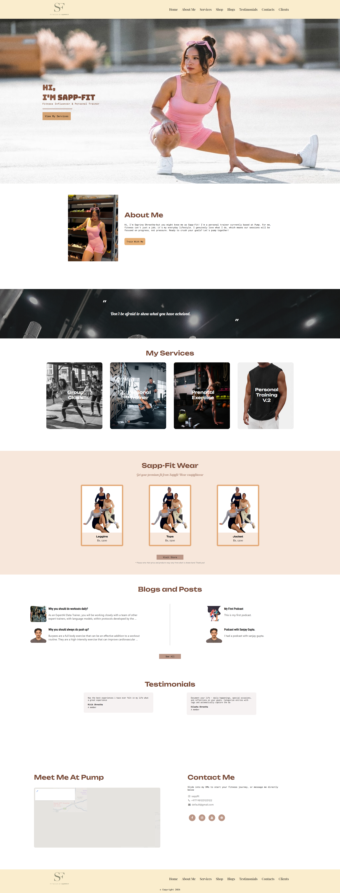
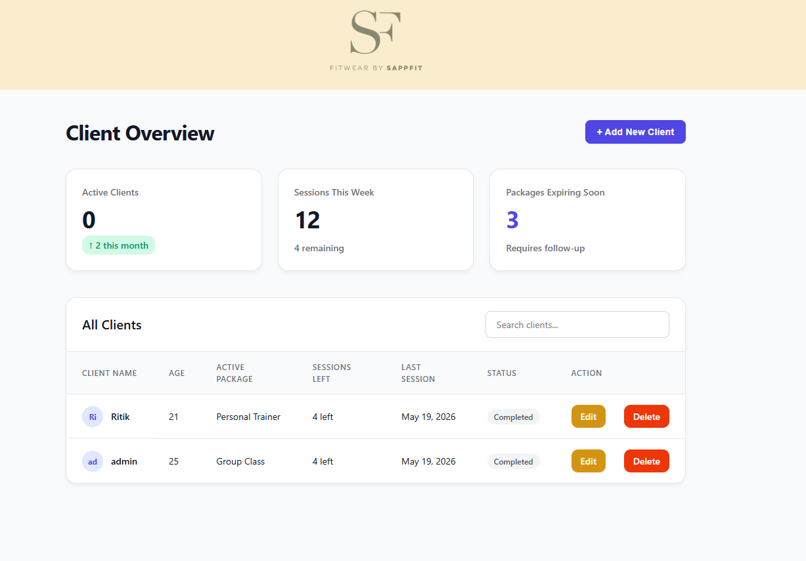
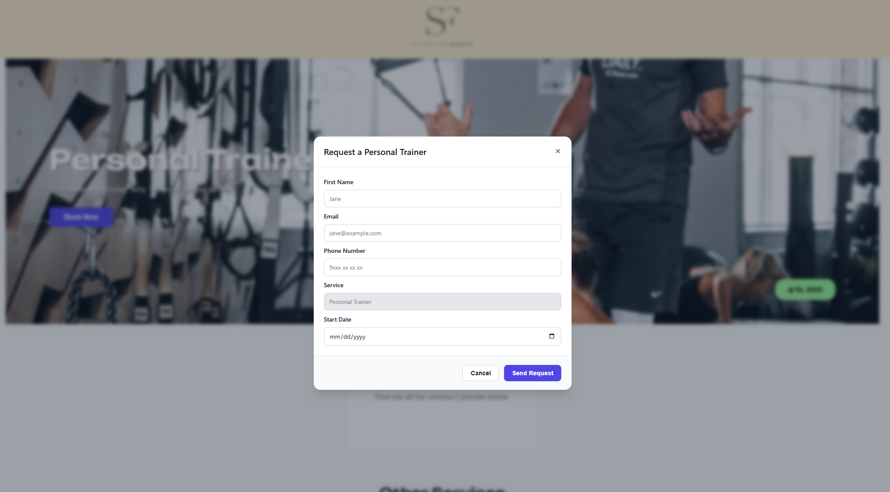

# SAPPFIT - Personal Training Platform

SAPPFIT is a custom web platform built for personal fitness trainer Saprina Shrestha (aka Sapp-Fit). It is designed to provide a seamless booking experience for clients while serving as a powerful, centralized management dashboard for the trainer.

## 📸 App Interface

<table>
  <tr>
    <td><b>Client Dashboard</b></td>
    <td><b>Booking Modal</b></td>
  </tr>
  <tr>
    <td></td>
    <td></td>
  </tr>
  <tr>
    <td><b>Service Catalog</b></td>
    <td><b>Interactive Toast Notifications</b></td>
  </tr>
  <tr>
    <td></td>
    <td></td>
  </tr>
</table>

## 🌟 Public-Facing Features (For Clients)

* **Service Catalog:** A dedicated page showcasing the different personal training packages and services offered at Pump.
* **Streamlined Booking System:** A friction-free "Book Now" flow. Clients can easily submit their contact details, preferred dates, and specific fitness goals through a fast-loading popup modal without navigating away from the page.
* **Responsive Design:** A fully mobile-optimized interface, ensuring clients can browse services and book sessions smoothly from their phones.
* **Trainer Bio & About:** A personalized section introducing Saprina, her training philosophy, and her background.

## 🔐 Administrative Dashboard (For the Trainer)

Behind the scenes, SAPPFIT operates as a mini-SaaS platform to manage the day-to-day operations of the fitness business.

* **Client Roster Management:** A secure admin panel to track all active and past clients.
* **Quick-Edit Modals:** The ability to add new clients or update existing profiles (age, gender, assigned package, and current status) instantly without refreshing the page.
* **Health & Injury Tracking:** Dedicated sections within client profiles to log specific medical notes, physical limitations, or past injuries for safer, tailored training.
* **Lead Capture & Notifications:** All booking requests submitted via the public site are automatically routed to the database, ensuring no client inquiries are lost in an email inbox.

## 🛡️ Built-In Security & Performance

* **Anti-Spam Protection:** The booking system is heavily protected against bots and spam using invisible honeypot fields and IP rate-limiting, ensuring the trainer only receives legitimate inquiries.
* **Action-Safe UI:** Forms are designed to prevent accidental double-bookings (e.g., button disabling on submit) and provide immediate visual feedback through toast notifications.
* **Optimized Media Delivery:** Infrastructure designed to serve high-quality fitness imagery quickly without slowing down the site's performance.
